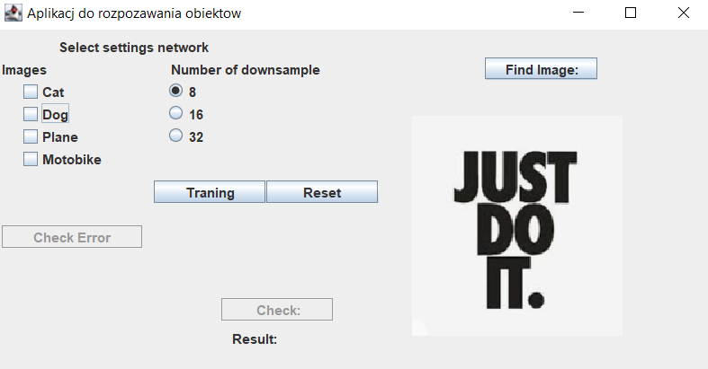

# Image-recognition-application

Desktop application for image recognition using recurrent neural networks.Using four learning patterns (cats, dogs, airplanes, cars), the application demonstrates the two main problems of neural networks.
The first problem relating to the larger number of patterns teaching the effectiveness of correct recognition of what is in the pictures decreases and
the second problem when recognizing two similar images e.g. dogs and cats, the effectiveness of the network decreases.

## How to run

After turning on the application, select network preferences (patterns and image scaling) and press test. If the error percentage is satisfactory for us we can finish the learning process and test the images of interest.
